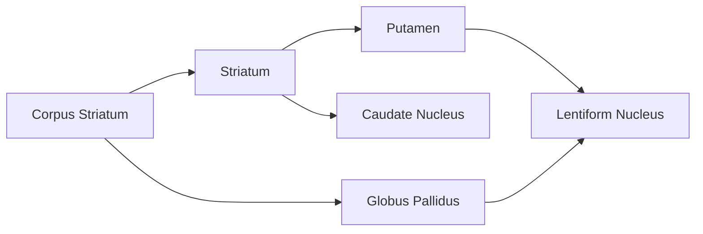

---
{"dg-publish":true,"permalink":"/pages/03-disorders-of-basal-ganglia/"}
---
# 03 Disorders of Basal Ganglia
## Repeating
- Lesion to **subthalamic nucleus** produces? #B24 #B23 
	- Answer: **Ballism** (flinging and flailing chorea)
	- **Hemiballism** happens ==contralateral== to the lesion
- Involuntary arrhythmic movements of a forcible, rapid, jerky type for those with lesions in the **caudate nucleus and putamen (striatum)** #B24  #B23 #B22 
	- Answer: **Chorea**
- Man from Antique complains of **tonic** posturing of neck and **involuntary jaw opening**. Family history reveals ==grandfather== had dystonic limbs and ==father== had dystonia and bradykinesia. What is the diagnosis? #B24 #B23 #B22 
	- Answer: **X-linked Dystonia Parkinsonism**
- Patient with **symmetric Parkinsonism**, dysphagia, dysarthria, cognitive lapses, and imbalance #B24 #B23 
	- Answer: **Multiple System Atrophy**
- Which of the following is not a core feature of Parkinson's? #B24 #B23 #B22 
	- Resting Tremor
	- **Cognitive Decline**
	- Postural Instability
	- Rigidity
- Protein that forms **Lewy bodies** in Parkinson's #B24 #B22 
	- Answer: **Synuclein**
- True regarding current basal ganglia circuitry #B24 #B22 
	- Enhanced conduction through the **indirect** pathway leads to **hypokinesia** by increasing pallidothalamic inhibition
- History of frequent falling and examination shows no tremors but has rigidity, bradykinesia, and **difficulty with vertical gaze**. What is the diagnosis? #B24 #B22 
	- Answer: Progressive Supranuclear Palsy
- **Slowness of movement**, slowly progressing limb stiffness, **dry mouth, urinary retention**. Patient also has **generalized rigidity and bradykinesia**. What is the diagnosis? #B24 #B22 
	- Answer: Multiple System Atrophy

## Important Notes

- **Striatum** receives signals while the **globus pallidus** outputs

| Disorder                       | Keyword                                                            |
| ------------------------------ | ------------------------------------------------------------------ |
| Chorea                         | Involuntary, irregular, purposeless, arrhythmic                    |
| Athetosis                      | Slow, writhing, continuous (snake)                                 |
| Huntington's                   | Overactive dopamine = chorea, **dementia**, behavioral abnormality |
| Dystonia                       | Sustained or intermittent contraction                              |
| X-linked Dystonia Parkinsonism | Males, Filipino, Dystonia                                          |
| Wilson's                       | Kayser-Fleishner eyes, liver + basal ganglia                                                                   |
